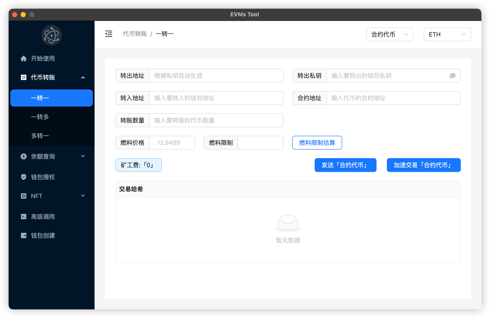
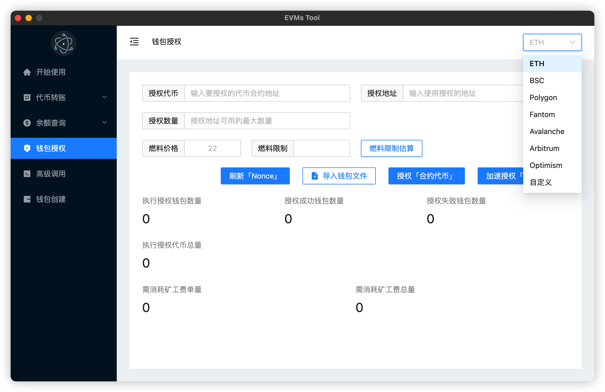
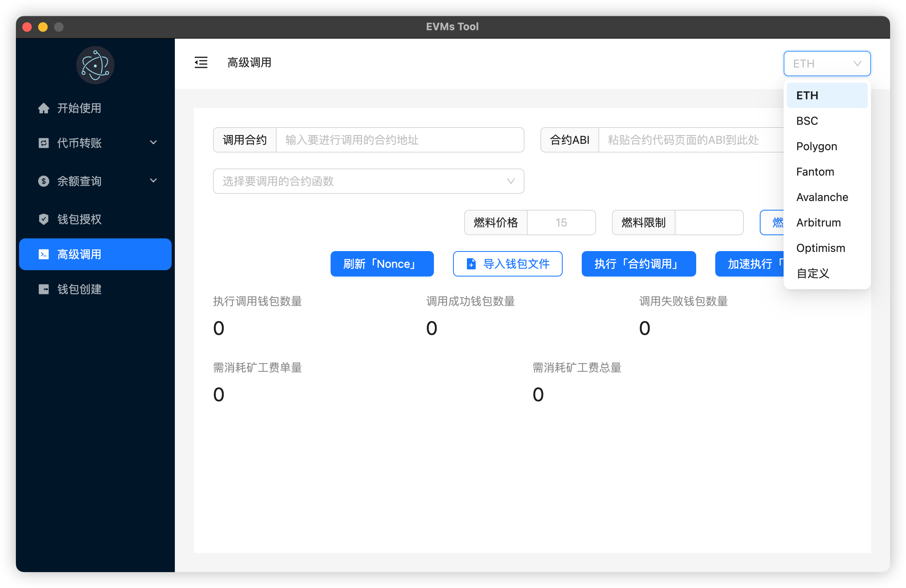
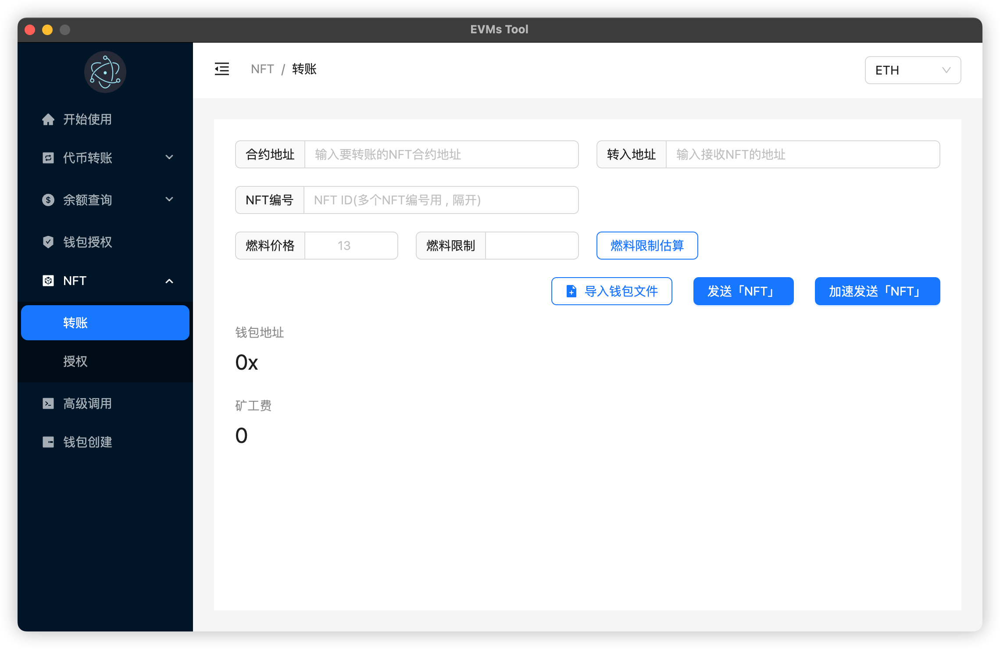
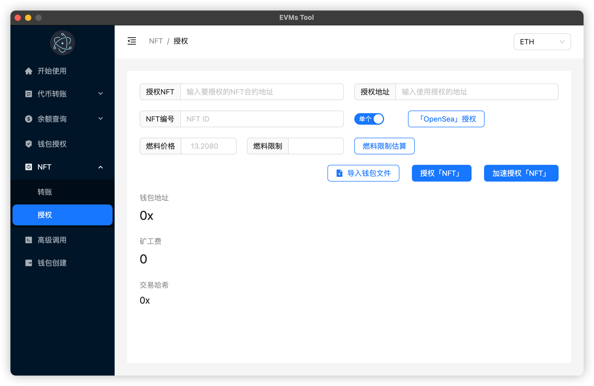
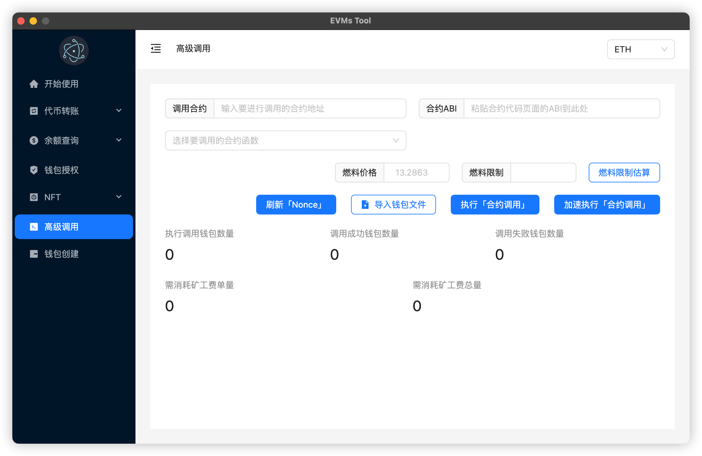

# EVMs Tool 「以太坊虚拟机交互工具」 🔧 🔧

> 支持所有兼容 EVM(以太坊虚拟机)的主网

## 功能

- 代币转账
  - 一转一
  - 一转多
  - > 多转一
    >
    > 前置条件: 导入<u>多钱包查询</u>生成的文件
- 余额查询
  - 单钱包查询
  - 多钱包查询
- 钱包授权
- NFT
  - 转账
  - 授权
- 钱包创建
- > 高级调用
  >
  > 通过利用<u>智能合约的 ABI</u>来调用指定的合约函数

## 运行

```shell
npm install
```

```shell
npm run dev
```

## 生成可执行文件(EXE 文件、DMG 文件)

```shell
# Windows
npm run build-win
# MacOS
npm run build-mac
# 生成的可执行文件存放在release目录
```

## 下载

```shell
# 链接
https://github.com/atlantis-l/EVMs-Tool/releases/tag/App
```













## 如果对你有帮助, 可以请我喝一杯咖啡 ☕️ ☕️

```shell
钱包地址: 0x6eafbeab09A6b0710063f7F1f076436A6b563ccf
```

## ⚠️ 免责声明

```shell
本工具仅用于学习交流, 使用者盈亏自负!!!
```
