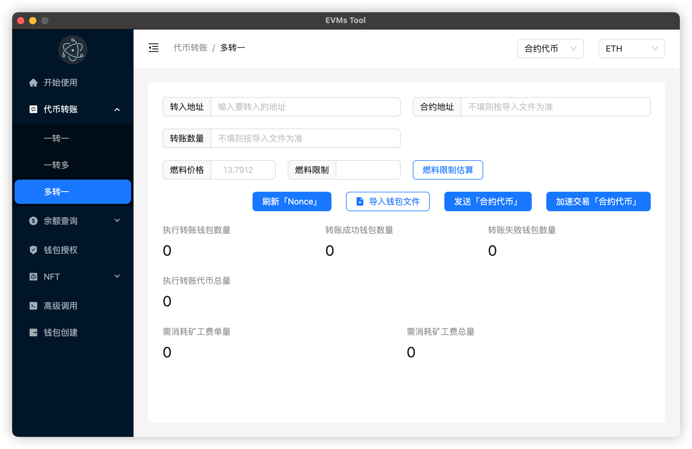
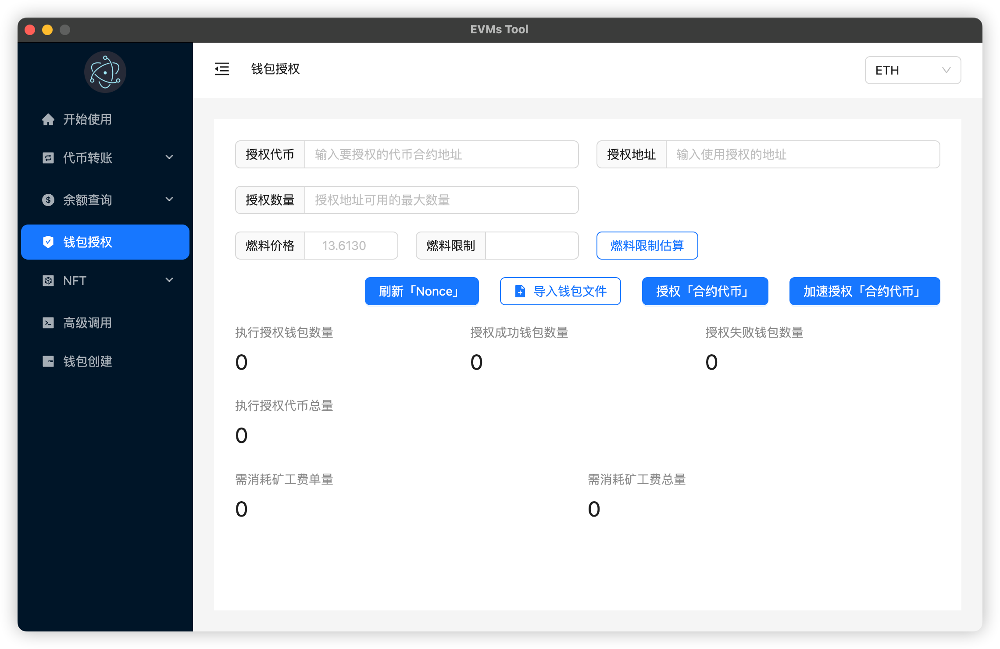

# EVMs Tool 「以太坊虚拟机交互工具」 🔧
>
> 支持所有兼容EVM(以太坊虚拟机)的主网
>
## 功能

- 代币转账
  - 一转一
  - 一转多
  - > 多转一
    >
    > 前置条件: 导入**多钱包查询**生成的文件
- 余额查询
  - 单钱包查询
  - 多钱包查询
- 钱包授权
- 钱包创建
- > 高级调用
  >
  > 通过利用智能合约的ABI来调用指定的合约函数

## 运行

```shell
npm install
```

```shell
npm run dev
```

## 生成可执行文件(EXE文件、DMG文件)

```shell
# Windows
npm run build-win
# MacOS
npm run build-mac
# 生成的可执行文件存放在release目录
```






## 如果对你有帮助, 可以请我喝一杯咖啡☕️

```shell
微信: Atlantis_00L
```

```shell
钱包地址: 0xa651316531d6061E292969EBeF782bf646bFbd7a
```


## ⚠️免责声明

```shell
本工具仅用于学习交流, 使用者盈亏自负!!!
```
